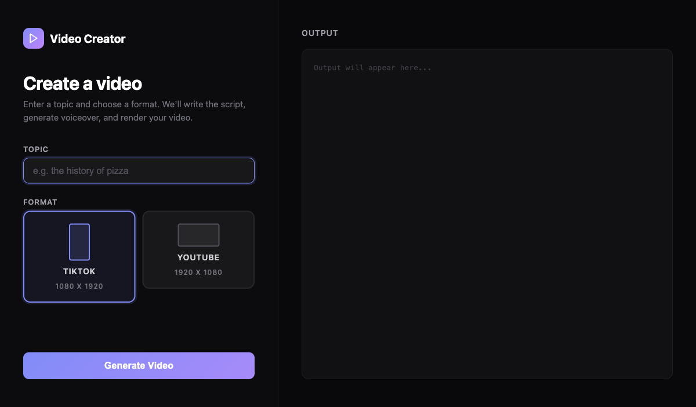

<div align="center">

# Video Creator

[](https://www.typescriptlang.org/)
[](https://www.remotion.dev/)
[](https://www.anthropic.com/)
[](LICENSE)

**Turn any topic into a narrated video with AI-generated scripts, voiceover, and animated scenes.**

</div>

## Screenshot



## About

Video Creator is a topic-to-video pipeline that transforms a simple text prompt into a fully rendered, narrated video. Enter a topic, choose TikTok (9:16) or YouTube (16:9) format, and the app handles everything — scriptwriting, text-to-speech voiceover, animated scene composition, and final video rendering.

### Key Features

- **AI Script Generation** — Claude writes punchy, scene-based scripts from any topic
- **Text-to-Speech Voiceover** — Edge TTS generates natural-sounding narration
- **Animated Scenes** — Word-by-word reveals, spring animations, CSS transforms, floating shapes
- **Scene Transitions** — Slide, fade, flip, wipe, and clock-wipe transitions between scenes
- **Format Selection** — TikTok (1080x1920) or YouTube (1920x1080)
- **Web UI** — Two-panel interface with real-time progress streaming
- **Remotion Studio** — Preview and fine-tune compositions in the browser

## Tech Stack

| Category | Technology |
|----------|-----------|
| **Frontend** | React 18, Remotion |
| **Backend** | Node.js, TypeScript |
| **AI/LLM** | Claude (Anthropic) via CLI |
| **TTS** | Edge TTS |
| **Video Rendering** | Remotion Renderer (H.264) |
| **Animations** | @remotion/animation-utils, @remotion/transitions |
| **Validation** | Zod |

## Architecture

```
┌─────────────────────────────────────────────┐
│                  Web UI (:3002)              │
│          Topic Input + Format Picker        │
└─────────────────┬───────────────────────────┘
                  │ SSE (real-time logs)
┌─────────────────▼───────────────────────────┐
│              Pipeline Engine                 │
│                                              │
│  ┌──────────┐  ┌──────────┐  ┌───────────┐  │
│  │  Claude   │→│ Edge TTS │→│  Remotion  │  │
│  │  Script   │  │ Voiceover│  │  Renderer  │  │
│  └──────────┘  └──────────┘  └───────────┘  │
└─────────────────┬───────────────────────────┘
                  │
┌─────────────────▼───────────────────────────┐
│           Remotion Composition               │
│                                              │
│  TransitionSeries → Scene Components         │
│  ├── GradientBackground (zoom, pan, rotate)  │
│  ├── Caption (word-by-word spring reveal)     │
│  ├── Narration subtitle                      │
│  ├── Audio playback                          │
│  └── Progress dots                           │
└──────────────────────────────────────────────┘
```

## Project Structure

```
videocreation/
├── src/
│   ├── index.ts                 # Remotion entry point
│   ├── Root.tsx                 # Composition registration
│   ├── Video.tsx                # TransitionSeries scene sequencing
│   ├── types.ts                 # Zod schemas (Script, Plan, Scene)
│   ├── server.ts                # Web UI server with SSE
│   ├── pipeline/
│   │   ├── makeVideo.ts         # CLI pipeline entry
│   │   ├── generateScript.ts    # Claude CLI script generation
│   │   ├── generateVoice.ts     # Edge TTS voiceover
│   │   ├── measureAudio.ts      # VTT duration parser
│   │   └── renderVideo.ts       # Remotion H.264 renderer
│   └── components/
│       ├── Scene.tsx             # Animated scene with transforms
│       └── GradientBackground.tsx # Gradient + floating shapes
├── public/                       # Generated audio + plan.json
├── out/                          # Rendered video output
├── .env.example                  # Environment config template
├── remotion.config.ts            # Remotion settings
├── package.json
└── tsconfig.json
```

## Getting Started

### Prerequisites

- **Node.js** 18+
- **Python 3** (for edge-tts)
- **Claude Code CLI** with active subscription

### Installation

```bash
# Clone the repository
git clone https://github.com/alfredang/videocreation.git
cd videocreation

# Install Node dependencies
npm install

# Install edge-tts
pip install edge-tts
```

### Environment Setup

```bash
cp .env.example .env
```

Edit `.env` with your settings (API key is optional if using Claude CLI):

```env
ANTHROPIC_API_KEY=sk-ant-...       # Optional if using Claude CLI
EDGE_TTS_VOICE=en-US-AriaNeural   # TTS voice
ANTHROPIC_MODEL=claude-sonnet-4-6  # Model selection
```

### Running

**Web UI (recommended):**

```bash
npm run dev
# Open http://localhost:3000
```

**CLI:**

```bash
npm run make-video -- "the history of pizza"
```

**Remotion Studio (preview/debug):**

```bash
npm run studio
```

## Contributing

1. Fork the repository
2. Create your feature branch (`git checkout -b feature/amazing-feature`)
3. Commit your changes (`git commit -m 'Add amazing feature'`)
4. Push to the branch (`git push origin feature/amazing-feature`)
5. Open a Pull Request

## Developed By

**Tertiary Infotech Academy Pte. Ltd.**

## Acknowledgements

- [Remotion](https://www.remotion.dev/) — Programmatic video creation in React
- [Anthropic Claude](https://www.anthropic.com/) — AI script generation
- [Edge TTS](https://github.com/rany2/edge-tts) — Free text-to-speech engine
- [Claude Code](https://claude.ai/claude-code) — AI-powered development

---

<div align="center">

If you find this project useful, please give it a star!

</div>
